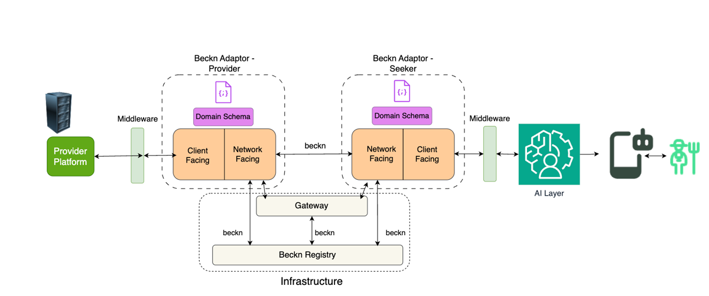
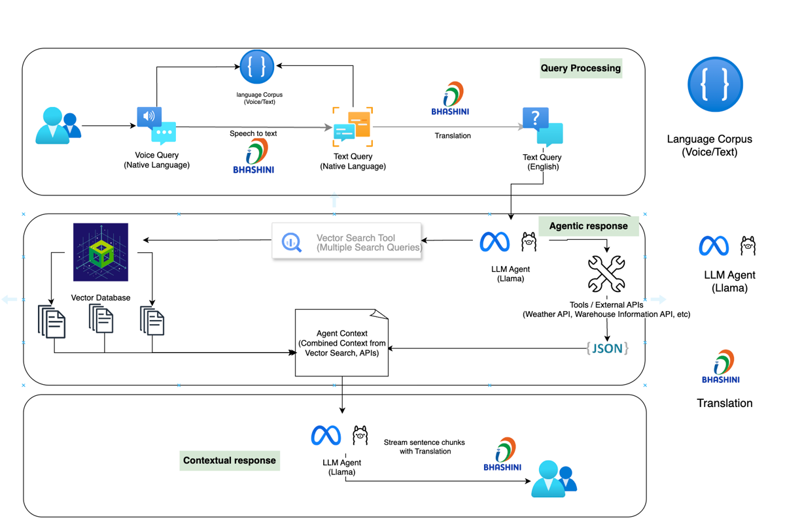

# OpenAgriNet (OAN)

OpenAgriNet (OAN) is a global network dedicated to transforming agriculture through Digital Public Infrastructure (DPI) and AI-powered solutions. By uniting governments, innovators, and organisations, we aim to revolutionise agricultural practices worldwide, driving sustainability and inclusivity in the sector.

---

## Purpose of This Document

This document is meant to provide all the necessary technical information to help all participants who want to build and integrate their applications with the OAN Network.

OAN Network is a Beckn protocol based network which allows transactions between Network Participants.

---

## Focus

OAN network aims to integrate the following services with the network and hence to all participants:

- Schemes
- Financial Services
- Market Access
- Weather System
- Soil Health System

Schemes and Weather work is progressed and initial integration is available to experience.

---

## Architecture Overview

The diagram below illustrates how various components interact in Open AgriNet (OAN) to support discovery, advisory, and service fulfilment in agriculture using the Beckn protocol and AI interfaces.

---

## Key Components

### 1. User Layer

- **User** — A farmer or agriculture stakeholder interacting via mobile or web.
- **Seeker Platform** — UI layer that facilitates interaction with the user. Connects to the AI layer for a conversational experience.

---

### 2. AI Layer (Agentic AI Component)

- Manages dialogue, session memory, and tool use.
- Interfaces with the BAP (via middleware) to trigger Beckn search and order calls.
- Performs retrieval-augmented generation (RAG) for crop and pest advisory.
- Integrates translation and speech-to-text / TTS engines for multi-lingual and voice interfaces.

---

### 3. Seeker-Side Beckn Adaptor (BAP)

- **Client-Facing Interface** — Interfaces with the AI layer and middleware to receive requests.
- **Network-Facing Interface** — Implements Beckn APIs and communicates with the Gateway and BPPs.
- **Domain Schema** — Defines the domain-specific ontology (agriculture-specific) used for interaction.

---

### 4. Provider-Side Beckn Adaptor (BPP)

- **Client-Facing Interface** — Connects to the Provider Platform via middleware.
- **Network-Facing Interface** — Responds to Beckn protocol messages (`search`, `on_search`, etc.).
- **Domain Schema** — Ensures consistency in the response format (e.g., crop advisory attributes, mandi price fields).

---

### 5. Provider Platform

Backend system integrated with actual services or information for agriculture use cases, including:

- Mandi prices
- Weather-based advice APIs
- Warehouse availability
- Document-based crop advisory (PDFs, manuals)

---

### 6. Network Infrastructure

- **Beckn Gateway** — Routes messages securely between BAPs and BPPs using signature validation and discovery.
- **Beckn Registry** — Maintains participant metadata, public keys, and service discovery information.

---

## Data Flow

1. User inputs a query (e.g., "What is the price of tomatoes in Nashik?") via the Seeker Platform.
2. The AI Layer processes the intent and either:
   - Answers directly using its vector DB and documents, or
   - Calls the Beckn API (via BAP adaptor) to search for live data.
3. The Seeker BAP sends a Beckn-compliant search request to the Gateway.
4. The Gateway routes the request to registered BPPs that match the criteria.
5. The Provider BPP fetches data from its Provider Platform and responds.
6. The response is returned through the same path back to the user via the AI layer.
7. Middleware between the AI Layer and BAP / BPPs handles schema translation and data validation.
8. The Domain Schema acts as the common vocabulary between AI-generated queries and Beckn-compliant payloads.
9. The architecture supports multi-language input/output via integration with services such as Bhashini.

---

## System Overview

This system is designed to:

1. Enable discovery and access of agricultural services via a Beckn-based network.
2. Provide a conversational AI layer for interaction in English and Indic languages.
3. Ingest structured (API-based) and unstructured (document-based) knowledge.
4. Host the user interface via web/mobile frontend with an AI-powered chatbot.
5. Enable robust monitoring and behaviour analysis in production.

---

## Agriculture Use Cases Supported

- Crop, pest, and pesticide advisory
- Weather forecast (region-specific)
- Mandi / APMC price discovery
- Warehouse storage capacity availability
