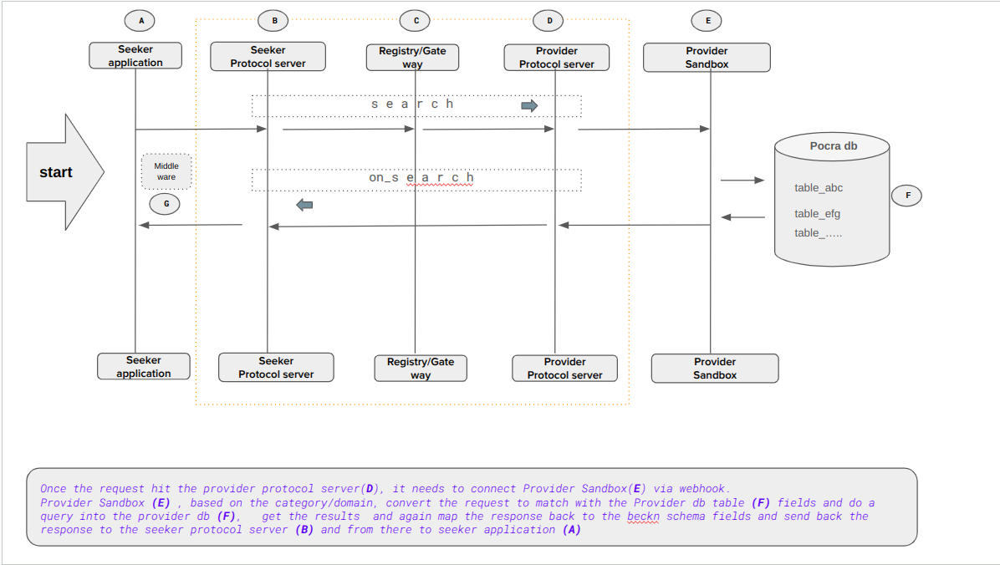

# Beckn Protocol - Quick Overview

OpenAgriNet is an implementation of Beckn Protocol  /Adpater.  And  the Beckn based network enables its participants to transact over the network using a set of common protocol.&#x20;

**Architecture & Flow Diagram**\
The following diagram shows how the transaction happens over a Beckn enabled network. 

<figure><figcaption></figcaption></figure>

Every Protocol Server instance has two components. One is client facing and the other is network facing.&#x20;

**In the case of BAP (ie. Seeker Application Platform)**&#x20;

Client facing Protocol Server manages building the context, validating the request body as per the Standard Beckn Open API schema, listens to the Message Queue, Aggregates the results in the case of Synchronous mode and forwards the results to the client side application .&#x20;

Network facing Protocol Server manages forwarding the request to the respective Participant or Beckn Gateway (BG). Also it validates the incoming requests from Participants & BG as per the Standard Beckn Open API schema and then validates the signature sent from the clients to ensure the data integrity.\
\
\
\
\
\
**In the case of BPP (ie. Provider Platform)**&#x20;

Client facing Protocol Server listens to the Message Queue and forwards the request to client application, exposes an endpoint where the client side application can send the results to the network which is again validated against the Standard Beckn Open API schema and pushed to the network facing Protocol Server.&#x20;

Network facing Protocol Server also listens to the Message Queue and forwards the request to the respective Participant or BG. Also it validates the incoming requests from Participants & BG as per the Standard Beckn Open API schema and then validates the signature sent from the clients to ensure the data integrity.

 
