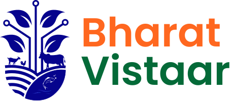
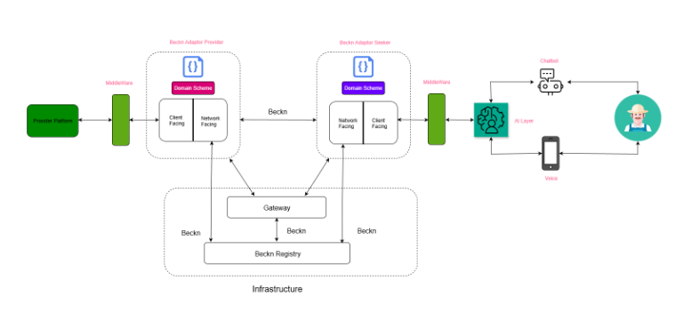

# INTRODUCTION TO VISTAAR

BharatVISTAAR is an initiative of the Ministry of Agriculture & Farmers Welfare (MoAFW), Government of India. It was launched as a National Digital Public Infrastructure (DPI) for Agriculture and aims to harmonise the agricultural digital landscape through open protocols, interoperable data exchanges, and AI-enabled extension services for every farmer in India. Built on OpenAgriNet (OAN), it builds on the same architectural principles of open networks as MahaVISTAAR, which was developed for Maharashtra, and extends the model to support agricultural ecosystems nationwide.

BharatVISTAAR is built using a modular, service-oriented architecture that allows different AI services, knowledge providers, and applications to integrate into the network. This approach enables scalable deployment of agricultural AI solutions while supporting ecosystem participation from developers, research institutions, service providers, and government platforms.

BharatVISTAAR aims to create a scalable AI infrastructure for agricultural services such as advisory, knowledge and decision support, and making government services more accessible to farmers across India.

## AI-Powered Architecture

BharatVISTAAR is built around a farmer-first interaction model where all system complexity is abstracted behind a conversational interface. The architecture spans five interconnected layers, from multi-channel farmer access through to external service ecosystems, unified by an open, Beckn-powered network and governed by cross-cutting security and observability capabilities.

